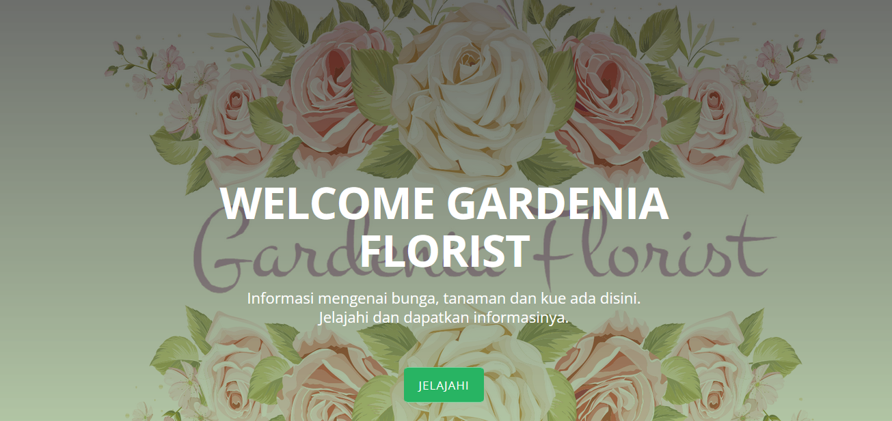

# Sistem Informasi Gardenia Florist

<h3>
Nama : ERIKA MAULIDIYA <br>
NIM  : 1810817220017
</h3>
<p align="center">
    
</p>

## Information

`Sistem Informasi Gardenia Florist` Merupakan sistem informasi yang berisikan informasi data bunga, tanaman hias dan tempat penjualannya
<br> diwilayah Kalimantan Selatan khususnya di Banjarmasin 
memiliki 3 halaman, yaitu:
- Landing Page
- Halaman Login
- Halaman Registrasi
- Dasboard User
- Halaman Bunga
- Halaman Data Bunga
- Halaman Tanaman Hias
- Halaman Data Tanaman Hias
- Dasboard Admin
- Halaman Tabel User (Admin)
- Halaman Tabel Data Bunga (Admin)
- Halaman Tabel Data Tanaman Hias (Admin)

## Requirements

- Laravel 8
- PHP 8.0.6
- Bootstrap 4/5

## Installation
1. Clone Repo gitHub
```bash
https://github.com/erikamaulidiya19/SIGardenflowers.git
```
2. Instal dependensi PHP dengan `composer install`
3. Instal Laravel melalui composer (instal local)
```bash
composer create-project laravel/laravel example-app
```
4. Buka Project yang sudah diclone di Tools `Visual Studi Code` dengan `Open Folder` 
5. siapkan database, masukan nama database kosong yang telah disediakan
6. copy .env example menjadi .env

7. generate key app laravel pada terminal

```bash
php artisan key:generate
```
8. migrate pada terminal
```bash
php artisan migrate
```
9. menjalankan situs web secara lokal
```bash
php artisan serve
```
## Username & Password
- Admin
username: admin123
password: admin123
- User
Melakukan Registrasi
