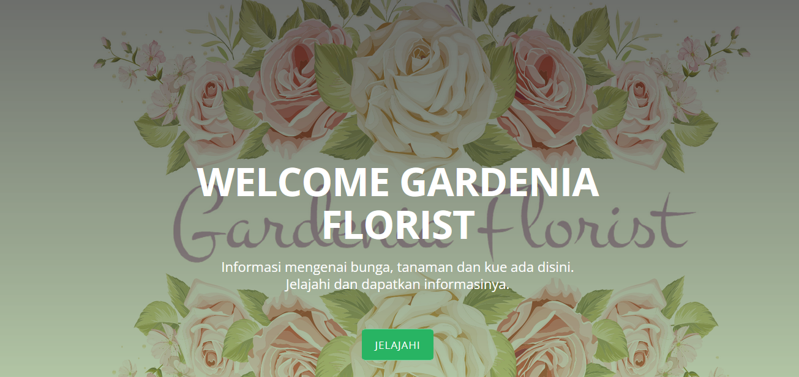

# Sistem Informasi Gardenia Florist

<h3>
Nama : ERIKA MAULIDIYA <br>
NIM  : 1810817220017
</h3>
<p align="center">
    
</p>

## Information

`Sistem Informasi Gardenia Florist` Merupakan sistem informasi yang berisikan informasi data bunga, kue, dan caffe
<br> diwilayah Kalimantan Selatan khususnya di Banjarmasin 
memiliki 3 halaman, yaitu:
- Landing Page
- Dasboard User
- Dasboard Admin (Tabel Data Bunga)

## Requirements

- Laravel 8
- PHP 8.0.6
- Bootstrap 4/5

## Installation
1. Clone Repo gitHub
```bash
https://github.com/erikamaulidiya19/SIGardenflowers.git
```
2. copy .env example menjadi .env
2. siapkan database, masukan nama database kosong yang telah disediakan
3. Instal dependensi PHP dengan `composer install`
4. Instal Laravel melalui composer (instal local)
```bash
composer create-project laravel/laravel example-app
```
5. generate key app laravel pada terminal

```bash
php artisan key:generate
```
6. migrate pada terminal
```bash
php artisan migrate
```
7. run seeder
```bash
php artisan db:seeder
```
8. menjalankan situs web secara lokal
```bash
php artisan serve
```
